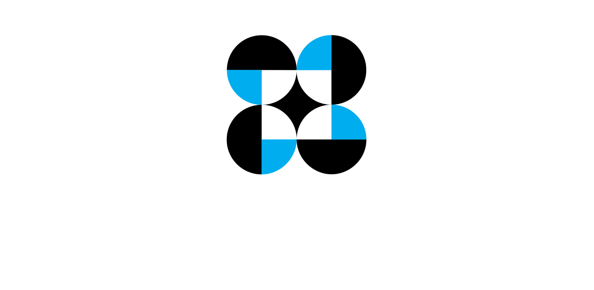

# DOST-X Centralized Database Management System

<p align="center">
  
</p>

A centralized web-based database system for the Department of Science and Technology Region X (DOST-X) that enables staff to view, add, edit, search, import, and export project records, with a file repository for storing Excel/CSV datasets.

---

## Quick Start

```bash
git clone https://github.com/punyeeta/DOST-X-Centralized-DBMS.git
cd DOST-X-Centralized-DBMS
npm install
npm run dev          # starts dev server at http://localhost:5173
```

> See [docs/setup.md](docs/setup.md) for full environment setup, build, and deployment instructions.

## Demo Credentials

| Role  | Email                | Password   |
|-------|----------------------|------------|
| Admin | `admin@dost.gov.ph`  | `admin123` |
| Staff | `user@dost.gov.ph`   | `user123`  |

## Documentation

| Document | Purpose |
|----------|---------|
| [docs/architecture.md](docs/architecture.md) | System architecture, folder structure, data model, and auth flow |
| [docs/setup.md](docs/setup.md) | Clone → install → run → build → deploy instructions |
| [docs/user-guide.md](docs/user-guide.md) | End-user guide for staff and administrators |
| [docs/progress-log.md](docs/progress-log.md) | Dated progress entries for supervisor tracking |
| [docs/CHANGELOG.md](docs/CHANGELOG.md) | Version-tagged list of all notable changes |
| [docs/turnover-checklist.md](docs/turnover-checklist.md) | Handover checklist — known issues, pending work, contacts |
| [docs/darkmode_design.md](docs/darkmode_design.md) | Dark mode design system specification |
| [docs/unit_based_access.md](docs/unit_based_access.md) | Unit-based access control implementation spec |

## Tech Stack

- **Frontend:** React 19 + TypeScript 6
- **Build Tool:** Vite 8
- **Styling:** Tailwind CSS v4 (via `@tailwindcss/vite` plugin)
- **Routing:** React Router v7
- **Font:** Google Sans Flex (variable)

## License

This project is developed under the DOST-X internship program. All rights reserved.
